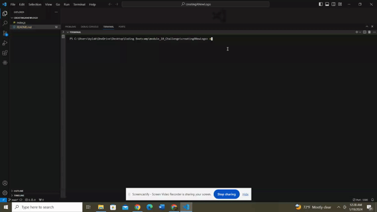

# Logo Generator

## Description
This project is to allow the user to create their own very simple logo by using the JavaScript prompts.

## Table of Contents
- [Installation](#installation)
- [Usage](#usage)
- [License](#license)
- [Credits](#contributing)

## Installation
This project was completed from scratch. I referenced course material from the University of Minnesota's Coding bootcamp to assist me as well as online resources to create my skeleton. Once that is completed, it is just trouble shooting from there (mainly using nodemon).

## Usage
This application creates a very simple logo design for the user based off of their answers to the app prompts.

## Credits
Code that was referenced by gitHub unsername potential-enigma, whos gitHub is linked below along with the starter code I used for this project.

https://github.com/coding-boot-camp/potential-enigma

This is my resouce for reference from the University of Minnesota's Coding bootcamp administration.

hhttps://bootcampspot.instructure.com/courses/4983/assignments/64613?module_item_id=1116067

These links were also used to brush up on basics:

https://learn.microsoft.com/en-us/cpp/c-language/switch-statement-c?view=msvc-170

https://coding-boot-camp.github.io/full-stack/github/professional-readme-guide

https://www.codingninjas.com/studio/library/methods-to-print-new-line-in-java

Please also check out my GitHub Profile if you would like:

https://github.com/kylaerod/

## License

This project is licensed under the MIT - see the [LICENSE.md]([MIT License](https://opensource.org/licenses/MIT)) file for details.
